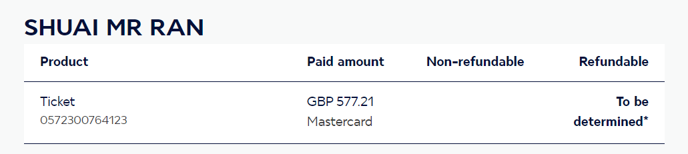

# 注意事项
- [x] 退款机票
- [ ] 查看是否成功退款
- [x] 取消酒店的预订,一定要取消预订因为到时候会扣钱.并且好像还先扣了我300pounds. 还是没扣我忘了.
[取消凭证](assets/8cba2ed4e0cda24c7cc98903fc2c261.jpg)
- [ ] 取消保险的费用,斌且取消来年的预订

[法航机票购买](https://wwws.airfrance.co.uk/)

- [ ] 酒店预定单
- [ ] 交通 机票
- [ ] 在读证明
- [ ] brp复印件 + 原件
- [ ] 护照复印件 + 原件
- [ ] cover letter 解释信
- [ ] 照片 
- [ ] 银行流水 3 个月 | 苏格兰没问题 | 中行 有问题 收不到短信|
- [ ] 行程单
- [ ] 保险 -> coverwise 官网 annual muti-trip insurance for europe 最后一天买
- [ ] 申请表
- [ ] 回执 是什么:回执是在fv网站填完所有信息后发给你的

保险

[保险的网站](https://www.coverwise.co.uk/Quote/Policy-Confirmation/2e245fa127c04f20a53ef68c499ad554)

