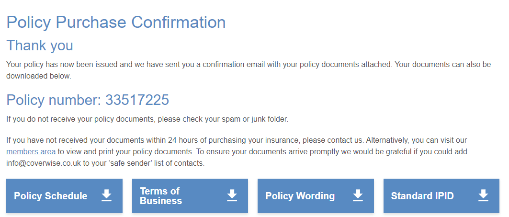

# 注意事项
- [ ] 退款机票
- [ ] 取消酒店的预订,一定要取消预订因为到时候会扣钱.并且好像还先扣了我300pounds. 还是没扣我忘了.
- [ ] 取消保险的费用,斌且取消来年的预订

[法航机票](https://wwws.airfrance.co.uk/)

- [ ] 酒店预定单
- [ ] 交通 机票
- [ ] 在读证明
- [ ] brp复印件 + 原件
- [ ] 护照复印件 + 原件
- [ ] cover letter 解释信
	- [ ] 爱尔兰就想去 但是因为疫情
	- [ ] 舍友是法国人,邀请我去.
- [ ] 照片 
	- [ ] 先试试 国内拍的海马体行不行
	- [ ] 剪头发
	- [ ] 不行 就直接在签证的photo me 拍摄
- [ ] 银行流水 3 个月 | 苏格兰没问题 | 中行 有问题 收不到短信|
	- [ ] 这三天每天让萱萱给我转 500pounds,小猪哼哼😕,6月3号的转了
	- [ ] 好像不太需要中行
	- [ ] 6月份的也打印一下
- [ ] 行程单
- [ ] 保险 -> coverwise 官网 annual muti-trip insurance for europe 最后一天买
- [ ] 预约单 带地图的
- [ ] 申请表
- [ ] 回执 是什么:回执是在fv网站填完所有信息后发给你的
- [ ] 付款 payment

保险

[保险的网站](https://www.coverwise.co.uk/Quote/Policy-Confirmation/2e245fa127c04f20a53ef68c499ad554)

